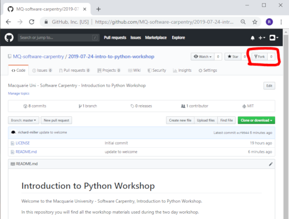
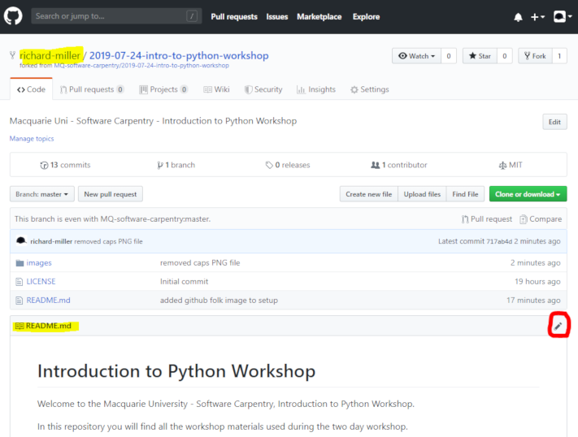

# Introduction to Python Workshop

Welcome to the Macquarie University - Software Carpentry, Introduction to Python Workshop.

In this repository you will find all the workshop materials used during the two day workshop.

## Here's our Workshop Collaboration Document

[https://tinyurl.com/y629s5ta](https://tinyurl.com/y629s5ta)

## Getting Started

1. **Forking**

   To create your own copy of this repository you need to **Fork** it (make a copy) using the *Fork* button in the top right hand corner of the GitHub page for this repository:
   
   
   
   A copy of this repository will be created in your personal GitHub account, and GitHub automatically take you there.
   
   Note the change in repository URL and title once you have created your own fork. 
   
2. **Comitting a Change**

   To demontstrate version control (and prove you are working on your fork) let's change this README.md document.
   
   While viewing this README.md, click the *Edit* (pencil) icon:
   
   
   
   then update the Launch Binder link (below in Step 3) to use your own GitHub username.
   
   Then below *Commit changes* heading, add a comment (eg, "Updated Binder Link") then click the **Commit Changes** button.

3. **Launch Binder and load your repository**

   We will be using Binder (https://mybinder.org) to run all the tools we will be using in this workshop.  
   
   Binder offers a free service that enables us to run Jupyter Lab in the cloud and access it via a web browser. We will be using Jupyter Lab for all our Python, Shell and Git exercises.
   
   Binder will *clone* (download a copy of) your workshop repository to provide you access to the lesson epsides and examples inside a Jupyter Lab. 
   
   To ensure Binder clones *your* respository, you will need to update the link below to include your GitHub username.
   
   
   <button name="button" onclick="https://mybinder.org/v2/gh/MQ-software-carpentry/2019-07-24-intro-to-python-workshop/master?filepath=welcome.ipynb&urlpath=lab/tree/welcome.ipynb" style="color: red">Dev</button>
   
   [Dev](https://mybinder.org/v2/gh/MQ-software-carpentry/2019-07-24-intro-to-python-workshop/master?filepath=welcome.ipynb&urlpath=lab/tree/welcome.ipynb)
   
   [//]: # (TIP: change the next line to include your GitHub username instead of the place holder)
   [Launch My Python Workshop on Binder](https://mybinder.org/v2/gh/PUT-YOUR-GITHUB-USERNAME-HERE/2019-07-24-intro-to-python-workshop/master?filepath=welcome.ipynb&urlpath=lab/tree/welcome.ipynb) - *don't click this link until you have inserted your GitHub own username*
   
   
